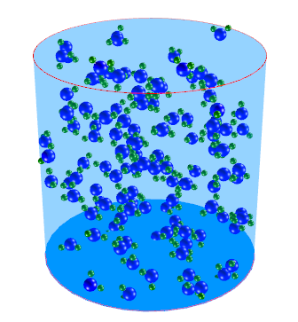

# 3DMolecules

## Overview
3DMolecules is a WPF (.NET 8) application that simulates and visualizes water molecules (H₂O) moving and colliding inside a transparent cylindrical container. It uses HelixToolkit.Wpf for 3D rendering and follows clean MVVM architecture with proper separation of concerns.

Now with fluid-like behavior: stable repulsion/cohesion/viscosity forces, world-space gravity, and a tiltable container that makes the liquid settle into a puddle and flow to the lower side when tilted.



## Key Features
- ⚛️ Real-time 3D molecular motion with elastic collision physics and fluid-like interactions
- ⚛️ Stable liquid forces (repulsion, cohesion, viscosity) + damping for smooth puddling
- ⚛️ Gravity control (supports zero and reversed) with magnetic center on the slider
- ⚛️ Tiltable container (X/Y tilt) with collisions computed in container-local space
- ⚛️ Interactive controls (Start / Pause / Reset / Molecule Count Slider up to 480)
- ⚛️? Runtime tuning panel for physics parameters (time step, gravity, stiffness, viscosity, etc.)
- ⚛️ Live FPS counter and physics diagnostics
- ⚛️? Clean MVVM architecture with dependency injection
- ⚛️ Proper resource management (IDisposable)
- ? Fully tested - 6 unit tests verify physics correctness
- ⚛️ Extensible - Easy to swap physics engines or add features

## Technology Stack
- .NET 8 / C# 12
- WPF / XAML
- HelixToolkit.Wpf (3D rendering)
- xUnit (testing framework)
- MVVM pattern with dependency injection

---

## ⚛️? Architecture

### Clean MVVM Separation

```
View (XAML)
    ? Data Binding
ViewModel (Coordinates)
? Uses
Services (Physics Engine)
    ? Works with
Models (Pure Data)
```

### Layers

**Models** (`Models/`)
- `MoleculeModel` - Pure physics data (position, velocity, rotation)
- No dependencies on UI or rendering

**Services** (`Services/`)
- `IPhysicsEngine` - Interface for physics implementations
- `CpuPhysicsEngine` - Current O(n�) collision detection, liquid forces, boundary-local collisions
- `ISimulationParameters` - Read-only interface exposing runtime physics tunables
- `MoleculeFactory` - Creates randomized molecules

**ViewModels** (`ViewModels/`)
- `SimulationViewModel` - Main coordinator with DI support, tilt handling, reset orchestration
- `SimulationParametersViewModel` - Bindable physics parameters for runtime tuning
- `BaseViewModel` - INotifyPropertyChanged implementation
- `RelayCommand<T>` - Command pattern with generic parameters

**Views** (`*.xaml`)
- `MainWindow.xaml` - Pure data binding, no logic; includes tuning sliders and tilt controls
- `Molecule` - 3D visual representation that syncs from `MoleculeModel`
- `CylindricalBoundary` - Builds container geometry and manages tilt transform

**Behaviors**
- `SliderBehavior` - Magnetic snapping behavior used to center the gravity slider at 0

**Configuration**
- `SimulationSettings` - Defaults and bounds for parameters and UI (no magic numbers)

---

## ⚛️ Testing

The project includes 6 unit tests that verify physics basics:

```bash
# Run all tests
dotnet test
```

Tests verify:
- Head-on collisions reverse velocities
- Boundary collisions reflect molecules
- Non-colliding molecules maintain velocity (with fluid forces disabled in test)
- Viscosity reduces relative velocity between molecules
- Factory creates valid molecules
- Diagnostics report status

See HOW_TO_USE_TESTS.md for details.

---

## ⚛️ Quick Start

### Build & Run
```bash
git clone https://github.com/kajencik/3DMolecules.git
cd 3DMolecules
dotnet build
dotnet run --project 3DMolecules/3DMolecules.csproj
```

Or open `3DMolecules.sln` in Visual Studio 2022+ and press F5.

### Run Tests
```bash
dotnet test
```

### Project Structure
```
3DMolecules/
⚛️? 3DMolecules/       # Main WPF application
?   ⚛️? Models/        # Pure data models
?   ⚛️? Services/      # Physics engines & factories
?   ?   ⚛️? CpuPhysicsEngine.cs
?   ?   ⚛️? IPhysicsEngine.cs
?   ?   ⚛️? ISimulationParameters.cs
?   ?   ⚛️? MoleculeFactory.cs
?   ⚛️? ViewModels/    # MVVM ViewModels
?   ?   ⚛️? SimulationViewModel.cs
?   ?   ⚛️? SimulationParametersViewModel.cs
?   ⚛️? Behaviors/     # WPF behaviors
?   ?   ⚛️? SliderBehavior.cs
?   ⚛️? Views/      # XAML views
?   ⚛️? Molecule.cs    # 3D visual component
?   ⚛️? CylindricalBoundary.cs # Container geometry & tilt
?   ⚛️? SimulationSettings.cs # Configuration defaults
?
⚛️? 3DMolecules.Tests/ # Unit test project
?   ⚛️? PhysicsEngineTests.cs
?
⚛️? Documentation/
```

---

## Notable Improvements (Fluid Simulation)
- Liquid forces redesigned for stability: repulsion core, mild cohesion, XSPH-like viscosity
- Global linear damping to reduce jitter
- World-space gravity (supports 0 and reverse) and boundary-local collision handling
- Tiltable container with X/Y sliders; gravity stays world-down so fluid flows toward the low side
- Runtime parameter panel: tune gravity, time step, stiffness, cohesion, viscosity, damping, etc.
- Gravity slider with magnetic snap to 0 while remaining linear
- Reset now restores POV, tilt, molecules, and parameter defaults
- Increased max molecule count to 480

---

## Performance

- Typical capacity: up to ~480 molecules depending on hardware and settings

Optimization roadmap:
1. Spatial Partitioning (Grid/Octree)
2. Geometry Instancing
3. Parallel Processing
4. GPU Compute Shaders

---

## Contributing

Contributions welcome. Priority areas:
- Spatial partitioning implementation
- GPU acceleration (ComputeSharp/ILGPU)
- Additional unit tests (energy conservation, momentum, etc.)
- UI enhancements (presets, numeric readouts)
- Performance profiling and benchmarks

### Development Workflow
1. Read the documentation (MVVM_REFACTORING_EXPLAINED.md)
2. Make your changes
3. Run tests: `dotnet test` (should all pass)
4. Submit pull request

---

## Learning Resources

This project demonstrates:
- MVVM pattern in WPF applications
- Dependency Injection without frameworks
- SOLID principles
- Unit testing physics logic in isolation
- Resource management with IDisposable
- Configuration management (centralized defaults)
- 3D graphics with HelixToolkit.Wpf
- Physics simulation (collision detection & response, fluid-like forces)

---

## ⚛️ License

MIT License � see `LICENSE`.

## ⚛️ Acknowledgments

- HelixToolkit.Wpf - 3D rendering
- WPF / .NET team - Framework
- Clean Code & SOLID principles community
- AI assistance (GitHub Copilot Chat) - Architecture guidance

---

## ⚛️ Project Status

Current Version: v2.1 (Fluid Simulation + Tuning UI)

Status: ? Stable - All tests passing, ready for extensions

Developed with: AI-assisted coding (GitHub Copilot Chat) following industry best practices

---

Enjoy exploring molecules in 3D with clean, maintainable, tested code! ⚛️

Questions? Check the documentation files or open an issue on GitHub.